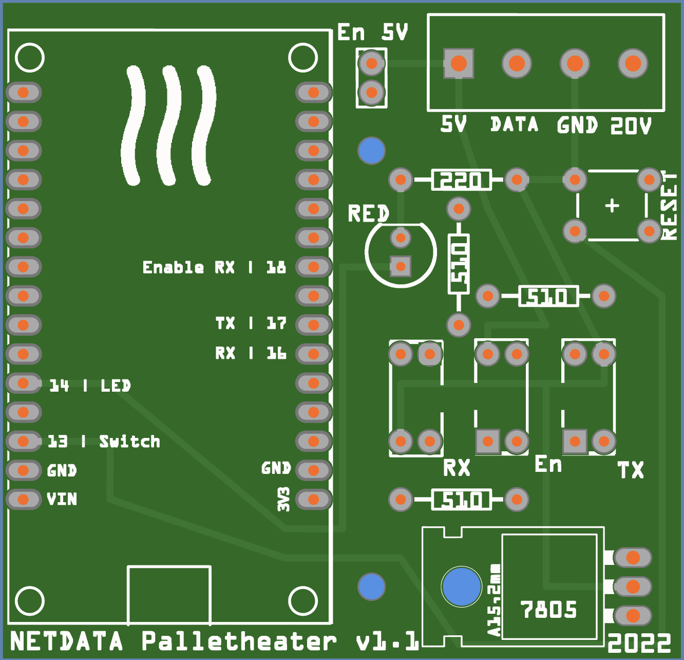

RAM (0x00)

| ADDR (HEX) | ADDR (DEC) | Formula   | Unit   | Description                  | Example or default value | Range      |
|------------|------------|-----------|--------|------------------------------|--------------------------|------------|
| 0x01       | 1          | x/2       | °C     | Ambient temperature          | 40 (== 20)               |            |
| 0x7D       | 125        | x         | Min    | Current time (min)           | 12                       | 0 - 59     |
| 0x7C       | 124        | x         | Hour   | Current time (hour)          | 8                        | 0 - 23     |
| 0x7A       | 122        | x         | Sec    | Current time (sec)           | 1                        | 0 - 59     |
| 0x7B       | 123        | x         | id     | Day of week 1=mon / 7=sun    | 1                        | 1 - 7      |
| 0x7E       | 126        | x         | day    | Current Day                  | 28                       | 1 - 31     |
| 0x7F       | 127        | x         | month  | Current Month                | 1                        | 1 - 12     |
| 0x80       | 128        | x         | year   | Current year                 | 22                       | 0 - 99     |
| 0x21       | 33         | x         | state  | Stove State                  | 0                        |            |
| 0x0D       | 13         | x/10      | rpm    | Feed rate ???                |                          |            |
| 0xDF       | 223        | x/10      | rpm    | Feed rate ???                |                          |            |
| 0x37       | 55         | (x+25)*10 | rpm    | smoke fan RPM                | 130 (== 1550 )           |            |
| 0x48       | 72         | (x+25)*10 | rpm    | smoke fan RPM                | 130 (== 1550 )           |            |
| 0x3E       | 62         | x         | °C     | Fumesmoke temperature        | 105                      |            |
| 0x34       | 52         | x         | amount | Flame power                  |                          |            |
| 0x19       | 25         | x         | amount | Room Fan setting             |                          |            |

EEPROM (0x20)

| ADDR (HEX) | ADDR (DEC) | Formula | Unit   | Description                            | Example or default value | Range      |
|------------|------------|---------|--------|----------------------------------------|--------------------------|------------|
| 0x4B       | 75         | x       | bool   | Beep is enabled                        | 1                        | 0 - 1      |
| 0x4F       | 79         | x       | id     | Language remote, see lookup table      | 1                        | 1 - 8      |
| 0xC6       | 198        | x       | bool   | Low pallets monitoring                 | 1                        | 0 - 1      |
| 0xC0       | 192        | x       | id     | Combustion Quality, see lookup         | 76                       |            |
| 0xC4       | 196        | x       | bool   | Pallet contact N.O. = 0 / N.C. = 1     | 0                        | 0 - 1      |
| 0x48       | 72         | x       | bool   | Ext Thermostat Modulate = 0 / Stop = 1 | 0                        | 0 - 1      |
| 0x49       | 73         | x       | bool   | Ext Thermostat N.O. = 0 / N.C. = 1     | 0                        | 0 - 1      |
| 0xEE       | 238        | x       | amount | Amount of starts                       | 1                        | ???        |
| 0x7D       | 125        | x       | °C     | Setpoint Room Temperature              | 23                       |            |
| 0x7F       | 127        | x       | amount | Flame power level                      |                          | 1 - 4      |
| 0x81       | 129        | x       | speed  | Room fan speed                         | 0                        | 0 - 3      |
| 0xE7       | 231        | x       | hours  | Working hours ???                      |                          |            |
| 0xEA       | 234        | x       | hours  | Working hours ???                      |                          |            |
| 0xEC       | 236        | x       | hours  | Working hours ???                      |                          |            |
 

# Language 

1 = ENG
2 = FRA
3 = DEU
4 = NLD
5 = POR
6 = SPA
7 = HRV
8 = DAN

# Combustion Quality

+G = 76
-3 = 2
-2 = 3
-1 = 4
 0 = 5
+1 = 6
+2 = 7
+3 = 8

N.O. = 